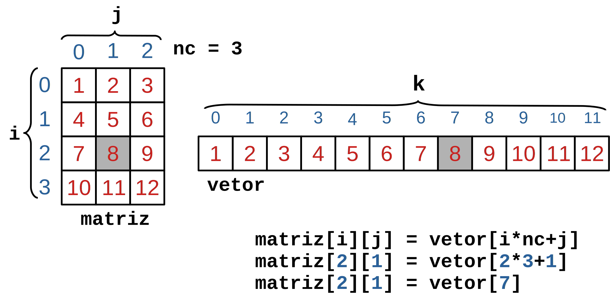

[](https://classroom.github.com/online_ide?assignment_repo_id=5469425&assignment_repo_type=AssignmentRepo)
# Trabalho de AEDs I
## Arquivos em linguagem C

### Descrição

Uma imagem digital é uma matriz de pixels (picture elements). O número de linhas e colunas definem a dimensão dessa matriz e o tipo (binária, tons de cinza e colorida), define, de certa forma, o número de bits necessário para representação dos pixels. Então, para armazenar uma imagem 1000x1000 com 256 tons de cinza, são necessários 1000x1000x8 bits (onde $2^8 =256$).
Um formato especialmente interessante é o formato PNM (Portable Any Map), composto pelos formatos PPM (Portable Pixmap Format) para imagens coloridas, PGM (Portable Greymap Format) para imagens em tons de cinza e PBM (Portable Bitmap Format) para imagens binárias. Neste formato, de forma conveniente, no entanto, pouco eficiente com relação ao espaço de armazenamento, todas as informações da imagem são gravados num arquivo texto. Nesta atividade, especificamente, usaremos o formato PBM - ASCII. Um exemplo de imagem nesse formato é:

```
P1
# This is an example bitmap of the letter "J"
6 10
0 0 0 0 1 0
0 0 0 0 1 0
0 0 0 0 1 0
0 0 0 0 1 0
0 0 0 0 1 0
0 0 0 0 1 0
1 0 0 0 1 0
0 1 1 1 0 0
0 0 0 0 0 0
0 0 0 0 0 0
```
Onde:
* P1 - indica que a imagem está no formato PBM - ASCII
* \# This... - indica uma linha de comentário
* 6 10 - indicam o número de colunas e o número de linhas da imagem, respectivamente
* o próximos 6 x 10 valores - indicam os valores dos pixels

Em linguagem C, podemos usar um vetor criado dinamicamente para armazenar os pixels da matriz imagem, conforme a figura abaixo. Esse vetor deve ter no mínimo $nl \times nc$ (nl = número de linhas e nc = número de colunas) elementos para armazenar todos os pixels da imagem. Por exemplo, na figura abaixo a matriz tem 4 linhas e 3 colunas, logo são 12 elementos. O vetor que representa essa matriz também tem 12 elementos. A correspondência entre os elementos da matriz (i,j) e o elemento do vetor (k) é dado pela expressão $$ k = i \times nc + j $$ Onde:
* i = linha da matriz
* j = coluna da matriz
* nc = número de colunas da matriz e
* k = índice do vetor




Na imagem exemplo, o elemento da posição i = 2 e j = 1, corresponde ao elemento de posição k = 2 * 3 + 1 = 7, conforme está ilustrado.

### Problema

Nesta atividade você deverá completar o código deste repositório para implementar as duas funções:
* ```image read_pts(char *name, int *nl, int *nc)```, que recebe o nome do arquivo que contém coordenadas dos pontos, nl = número de linhas e nc = número de colunas (passados por referência). Esta função deve ler de um arquivo de entrada, as dimensões da matriz imagem, o número $n$ de pixels com valor 1 e as $n$ coordenadas $(i,j)$. Em função do tamanho da matriz, alocar um vetor de dimensão $nl \times nc$ para representar essa matriz. Esse vetor/matriz deve ter o valor 1 nas coordenadas $(i,j)$ e zero, caso contrário. O vetor alocado é retornado como resultado da chamada da função.

* ```void write_pbm(image img, char *name, int nl, int nc)```, que recebe o vetor que representa a imagem, o nome do arquivo pbm que será criado por essa função, o número de linhas e o número de colunas da image. Os dados da matriz (representada no vetor) imagem, devem ser gravados conforme especificado como comentário da função.


### Exemplo
_*Entrada*_

```text
10 10
30
  1   4   1   5   2   3   2   4   2   5   2   6   3   2   3   7   4   2   4   3 
  4   6   4   7   5   2   5   3   5   4   5   5   5   6   5   7   6   2   6   3 
  6   6   6   7   7   2   7   7   8   1   8   2   8   3   8   6   8   7   8   8
```
_*Saída*_
```
P1
#imagem exemplo
10 10
0 0 0 0 0 0 0 0 0 0
0 0 0 0 1 1 0 0 0 0
0 0 0 1 1 1 1 0 0 0
0 0 1 0 0 0 0 1 0 0
0 0 1 1 0 0 1 1 0 0
0 0 1 1 1 1 1 1 0 0
0 0 1 1 0 0 1 1 0 0
0 0 1 0 0 0 0 1 0 0
0 1 1 1 0 0 1 1 1 0
0 0 0 0 0 0 0 0 0 0
```
